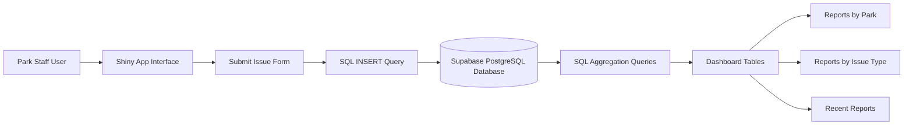
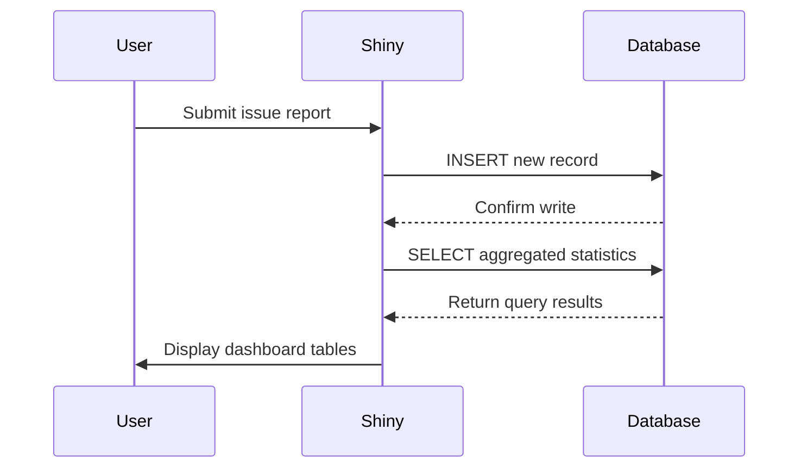

# Park Quality Tracker⛲️

SYSEN 5460 – Midterm Exercise: DL Challenge

Author: **Selena Miao**
Cornell University – Systems Engineering

---

# Project Overview

This project implements a lightweight reporting and monitoring tool for park quality issues. The goal is to demonstrate how a simple data application can help public service staff collect information in the field and view database summaries in near real time.

The application is built using **R Shiny** for the interface and **Supabase PostgreSQL** as the cloud database backend.

Users can submit issue reports through a form, and the app writes the information directly to the database. The dashboard then queries the same database to display aggregated statistics and recent reports.

The system is intentionally minimal but functional, showing how a small operational tool could support park maintenance monitoring.

---

# Use Case

Park staff often observe issues such as:

* trash overflow
* flooding on trails
* playground damage
* restroom cleanliness issues
* visitor injuries

This application provides a simple interface for recording these events and tracking trends.

The app allows staff to:

submit issue reports
track reports by park
track reports by issue type
view recent submissions

Although the data used in this project is synthetic, the structure reflects a realistic operational reporting workflow.

---

# System Architecture

The system includes three main components:

1. Shiny application interface
2. Supabase PostgreSQL database
3. SQL queries that generate dashboard summaries

The diagram below illustrates the data flow.



---

# Database Schema

The application uses a single main table.

## Table: quality_reports

| Column      | Type      | Description          |
| ----------- | --------- | -------------------- |
| id          | BIGSERIAL | Unique identifier    |
| park_name   | TEXT      | Name of the park     |
| issue_type  | TEXT      | Category of issue    |
| severity    | INTEGER   | Severity level (1–5) |
| notes       | TEXT      | Optional description |
| reported_by | TEXT      | Reporter name        |
| reported_at | TIMESTAMP | Submission time      |

---

# Data Flow Diagram

This diagram shows how the application interacts with the database.



---

# Key Features

## 1. Submit Issue Reports

The Shiny interface includes a form where users can enter:

park name
issue type
severity level
reporter name
optional notes

When the **Submit Report** button is clicked, the app inserts the data into the database.

---

## 2. Database Aggregation

The dashboard automatically displays summary statistics including:

number of reports by park
number of reports by issue type

These summaries are generated using SQL aggregation queries.

Example query:

```sql
SELECT park_name, COUNT(*) AS reports
FROM public.quality_reports
GROUP BY park_name
ORDER BY reports DESC;
```

---

## 3. Recent Reports

The dashboard displays the ten most recent submissions using a query similar to:

```sql
SELECT park_name, issue_type, severity, reported_by, notes, reported_at
FROM public.quality_reports
ORDER BY reported_at DESC
LIMIT 10;
```

---

# Running the Application

## Step 1: Install Required Packages

```r
install.packages(c(
  "shiny",
  "DBI",
  "RPostgres",
  "bslib"
))
```

---

## Step 2: Configure Database Credentials

Database credentials are **not stored in the source code**.

Instead, they must be stored as environment variables in a `.Renviron` file.

Example configuration:

```
SUPABASE_HOST=your_pooler_host
SUPABASE_PORT=5432
SUPABASE_DB=postgres
SUPABASE_USER=your_database_user
SUPABASE_PASSWORD=your_database_password
```

Example values for Supabase (these will vary depending on the project):

```
SUPABASE_HOST=aws-0-us-west-2.pooler.supabase.com
SUPABASE_PORT=5432
SUPABASE_DB=postgres
SUPABASE_USER=postgres.projectref
SUPABASE_PASSWORD=your_database_password
```

After editing `.Renviron`, restart the R session.

---

## Step 3: Run the Application

Once environment variables are configured, run the Shiny app:

```r
shiny::runApp()
```

The application will launch in a browser window.

---

# Project Structure

```
project-folder

app.R
README.md
codebook.md
.gitignore
```

### Files📃

**app.R**

Main Shiny application including UI and server logic.

**README.md**

Project description and instructions.

**codebook.md**

Documentation of database schema.

**.gitignore**

Prevents sensitive files such as `.Renviron` from being pushed to GitHub.

---

# Security Considerations

Database credentials are never stored directly in the code.

Instead, the application reads credentials using environment variables:

```r
Sys.getenv("SUPABASE_HOST")
Sys.getenv("SUPABASE_USER")
Sys.getenv("SUPABASE_PASSWORD")
```

The `.Renviron` file containing secrets is excluded from version control using `.gitignore`.

This ensures that sensitive credentials are not exposed in the repository.

---

# Reproducibility

The project is designed so that another user can run the application by:

cloning the repository
creating their own `.Renviron` file
providing Supabase database credentials
running `shiny::runApp()`

This approach ensures that the project is reproducible without exposing sensitive information.

---

# Possible Extensions

Future improvements could include:

interactive charts using Plotly
mapping park locations using geospatial data
filtering reports by date or severity
user authentication for park staff
automated alerts for high severity reports

These additions would transform the prototype into a more complete operational dashboard.

---

# Author✍️

Selena Miao
Cornell University
SYSEN 5460 – Data Science for Socio-Technical Systems

---
